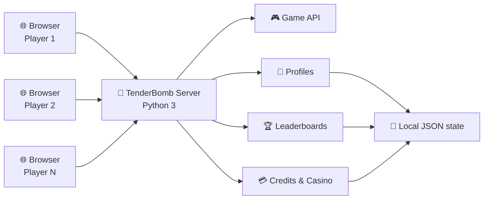

<div align="center">


### Тендеры закончились. Началась игра.

**TenderBomb** превращает офисный мир закупок, закрывашек и ФАС  
в локальную браузерную аркаду с несколькими игровыми режимами, рейтингами и общей экономикой.

<br>

[](https://github.com/schiz027/TenderBomb/releases)


<br>

[**🚀 Быстрый запуск**](#-быстрый-запуск) ·
[**🎮 Игровые режимы**](#-игровые-режимы) ·
[**🧠 Как это устроено**](#-как-это-устроено) ·
[**📦 Releases**](https://github.com/schiz027/TenderBomb/releases)

</div>

---

## 💣 Что такое TenderBomb

TenderBomb — это не одна игра, а небольшая **локальная игровая площадка для браузера**.

В основе — тематический «сапёр» про тендеры и закрывашки. Вокруг него появились шашки, танчики и казино. Все режимы объединяет серверная часть: она хранит профили игроков, рекорды, кредиты и общие игровые данные.

Проект рассчитан в первую очередь на запуск **в локальной сети**: один компьютер поднимает сервер, остальные просто открывают ссылку в браузере.

> [!TIP]
> Никакого отдельного клиента устанавливать не нужно. Для сервера достаточно Python 3, а игрокам нужен только современный браузер.

### ✨ Что уже умеет проект

- единый профиль игрока и сохранение ника;
- постоянные лидерборды и рекорды;
- внутренняя система кредитов между игровыми режимами;
- несколько уровней сложности в TenderBomb;
- одиночные и PvP-шашки;
- аркадные танчики;
- казино со слотами, ставками и джекпотом;
- история крупных выигрышей;
- несколько цветовых тем интерфейса;
- уведомления игрокам при перезапуске или отключении сервера;
- запуск обычным окном или через tray-режим в Windows.

---

## 🎮 Игровые режимы

| Режим | Что внутри |
|---|---|
| 💣 **TenderBomb** | Тендерный сапёр с «закрывашками», флажками, ФАС, бонусами и тремя уровнями сложности: **Экспресс**, **Госзаказ**, **Импортозамещение**. |
| ♟️ **Шашки** | Одиночная игра против бота и PvP. За победы начисляются кредиты; поле корректно ориентируется для обеих сторон. |
| 🪖 **Танчики** | Аркадный режим с очками, прогрессией и кредитной наградой за результат боя. |
| 🎰 **Casino** | Слоты с несколькими ставками, таблицей выплат, тематическими символами, джекпотом и историей крупных выигрышей. |

### 💳 Общая экономика

Кредиты связывают игровые режимы между собой: их можно заработать в TenderBomb, шашках и танчиках, а затем использовать в казино.

Это превращает набор мини-игр в одну общую игровую систему, а не четыре независимые страницы.

---

## 🚀 Быстрый запуск

### Вариант 1 — обычный запуск Windows

Требуется **Python 3**.

```bat
start-server.bat
```

После запуска открыть:

```text
http://localhost:8080/
```

Скрипт автоматически покажет доступные LAN-адреса. Их можно отправить коллегам, подключённым к той же локальной сети.

Пример:

```text
http://192.168.1.25:8080/
```

### Вариант 2 — сервер в системном трее

```bat
start-server-tray.bat
```

Подходит, если TenderBomb должен работать в фоне без постоянно открытого консольного окна.

### Вариант 3 — вручную

```bash
python server.py 8080
```

> [!IMPORTANT]
> Для сохранения лидербордов, профилей и общей экономики запускайте проект через `server.py`. Простого открытия `index.html` недостаточно для полной функциональности.

---

## 🧠 Как это устроено



Клиентская часть полностью работает на **HTML/CSS/Vanilla JavaScript**.  
Python-сервер обслуживает файлы приложения и отвечает за состояние, которое должно быть общим для всех игроков.

### Стек

| Слой | Используется |
|---|---|
| UI | HTML5, CSS3 |
| Игровая логика | Vanilla JavaScript ES6+ |
| Сервер | Python 3 |
| HTTP | `http.server` / стандартная библиотека Python |
| Хранилище | локальные JSON / генерируемые файлы состояния |
| Windows launcher | BAT + PowerShell |

**Внешние Python-зависимости не требуются.**

---

## 🗂️ Структура проекта

```text
TenderBomb/
│
├── assets/                  # графика, логотипы и игровые иконки
│
├── index.html               # основной интерфейс
├── styles.css               # стили и цветовые темы
│
├── game.js                  # TenderBomb / сапёр
├── checkers.js              # шашки
├── tanks.js                 # танчики
├── casino.js                # казино и слот-машина
│
├── server.py                # HTTP-сервер, API и состояние
├── server-tray.ps1          # управление сервером из tray
├── start-server.bat         # обычный Windows-запуск
├── start-server-tray.bat    # фоновый Windows-запуск
│
├── CHANGELOG.md             # история версий
├── CONTRIBUTING.md          # правила работы с Git
└── docs/
    └── RELEASING.md         # порядок выпуска релиза
```

Во время работы сервер создаёт локальные служебные данные — например `leaderboard-records.json`, `leaderboard-cache.js` и `.server-notice.json`. Они исключены из репозитория через `.gitignore`.

---

## 🏆 Лидерборды и профили

Сервер хранит результаты централизованно, поэтому игроки в локальной сети видят общие таблицы рекордов.

Профиль привязывает игровой ник к локальному игроку, а результаты разных режимов могут использовать общую систему кредитов.

Это позволяет использовать один TenderBomb-сервер как небольшую внутреннюю игровую площадку для всей команды.

---

## 📦 Версии и релизы

Проект находится в активной разработке.

**Текущий опубликованный релиз: `0.1.5`**

Начиная со следующей версии новые теги оформляются в виде:

```text
v0.1.6
v0.2.0
v1.0.0
```

Версионирование следует **Semantic Versioning**:

- **PATCH** — исправления;
- **MINOR** — новая совместимая функциональность;
- **MAJOR** — крупные несовместимые изменения.

Исторические версии `0.1.3`–`0.1.5` остаются без переименования.

<div align="center">

### [📥 Открыть GitHub Releases](https://github.com/schiz027/TenderBomb/releases)

</div>

Полная история изменений находится в [CHANGELOG.md](CHANGELOG.md).

---

## 🛠️ Разработка

Для новых изменений используются короткие тематические ветки:

```text
feat/<name>
fix/<name>
docs/<name>
refactor/<name>
chore/<name>
```

Коммиты оформляются по **Conventional Commits**:

```text
feat(casino): add bonus mechanic
fix(checkers): correct king capture logic
fix(server): prevent duplicate credit reward
docs: improve local launch guide
chore(release): prepare v0.1.6
```

<details>
<summary><strong>Подробнее о правилах разработки</strong></summary>

<br>

- правила работы с репозиторием — [CONTRIBUTING.md](CONTRIBUTING.md);
- история изменений — [CHANGELOG.md](CHANGELOG.md);
- выпуск новых версий — [docs/RELEASING.md](docs/RELEASING.md).

</details>

---

## 🗺️ Куда дальше

Ближайшая линия разработки — **0.1.x → 0.2.0**.

Новые игровые механики, баланс и интерфейс могут меняться по мере развития проекта. Стабильные изменения фиксируются в Changelog и GitHub Releases.

---

<div align="center">


**TenderBomb**

*Survive the tender. Defuse the requirements.*

</div>
